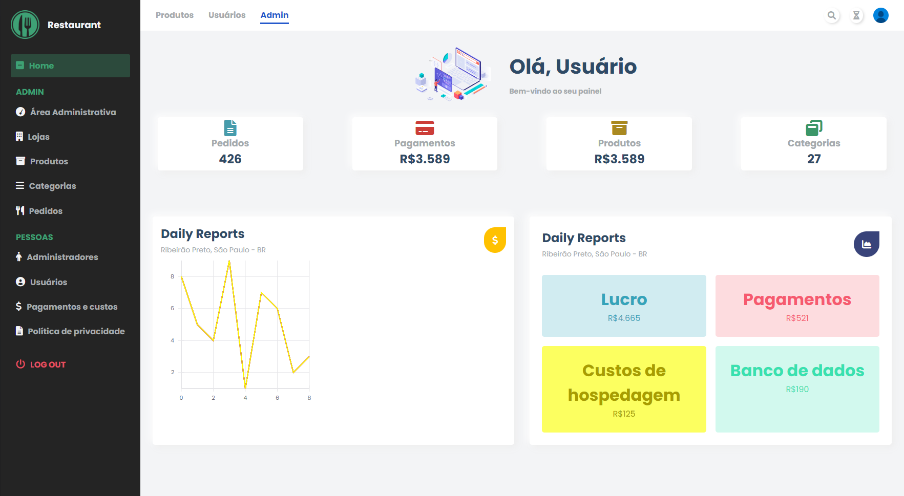

<h1 align="center">Restaurant ADM System | Admin Dashboard com ReactJS</h1>

    

  <a href="#-tecnologias">Tecnologias</a>&nbsp;&nbsp;&nbsp;|&nbsp;&nbsp;&nbsp;
  <a href="#-projeto">Projeto</a>&nbsp;&nbsp;&nbsp;|&nbsp;&nbsp;&nbsp;
  <a href="#memo-licença">Licença</a>

 
  
  

  

 

  

## 📄 Descrição:

Este projeto foi desenvolvido para o Front-End de um sistema de gestão para restaurantes. O desafio era criar uma interface simples e direta, mas sem perder funcionalidades importantes para que o usuário pudesse administrar seu negócio de forma rápida e intuitiva.

## 🚀 Tecnologias:

Esse projeto foi desenvolvido com as seguintes tecnologias:

### ReactJS

### CSS3

### Font Awesome

### [Charts JS](https://www.chartjs.org/)

## 🚧 Projeto:

### [Confira aqui!](https://adm-dash.vercel.app/)

## 🎨 Inspiração:

## 📝 Licença

Esse projeto está sob a licença MIT. Veja o arquivo LICENSE para mais detalhes.

Made by Jhonatan Oliveira.
